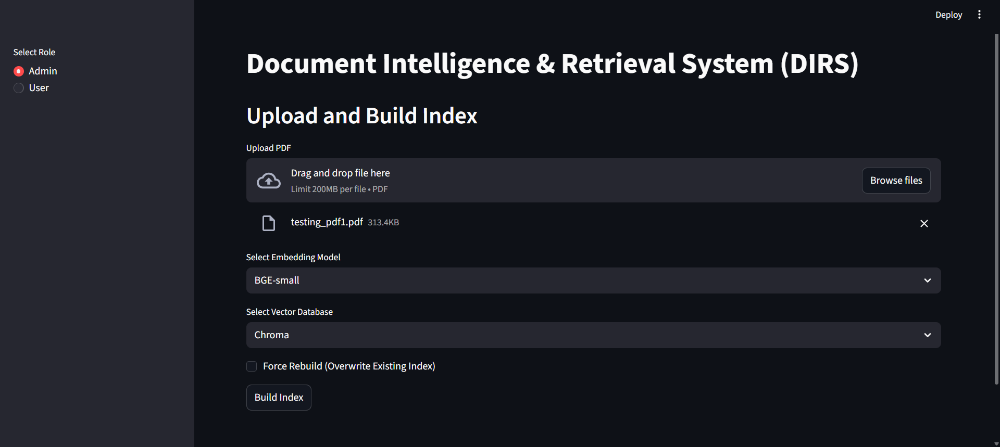
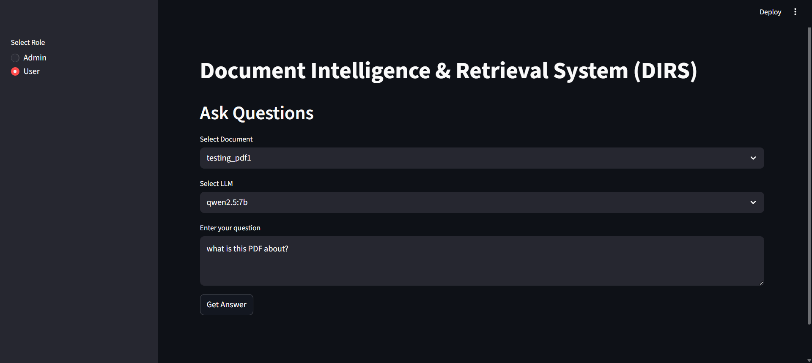
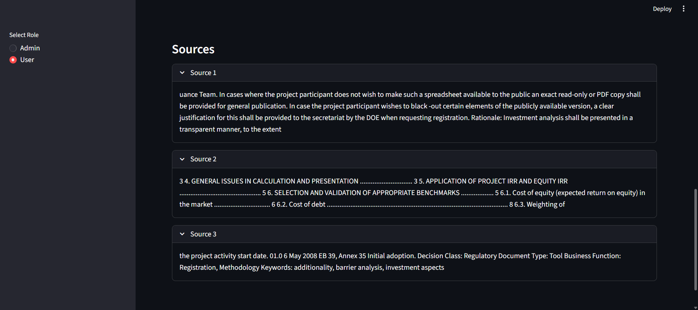

# DIRS - Document Intelligence & Retrieval System

DIRS is a modular Retrieval-Augmented Generation (RAG) system built in Python.  
It allows users to upload PDF documents and ask natural language questions about their content. The system retrieves relevant information from the documents and generates context-aware answers using a language model.

This project is designed as a foundation for building intelligent document understanding systems.

---

## What This Project Does

DIRS takes unstructured PDF documents and turns them into a searchable knowledge base.

When a document is uploaded:

1. The PDF is parsed and text is extracted.
2. The extracted text is divided into meaningful chunks.
3. Each chunk is converted into a numerical vector representation using an embedding model.
4. These vectors are stored in a vector database.
5. When a user asks a question, the system retrieves the most relevant chunks using semantic similarity.
6. The retrieved content is passed to a language model to generate a final answer.

This enables intelligent question-answering over private documents.

---

## Core Idea: Retrieval-Augmented Generation (RAG)

Traditional language models rely only on their pre-trained knowledge.  
DIRS enhances this by retrieving relevant information from user-provided documents before generating an answer.

This improves:
- Accuracy
- Context awareness
- Relevance
- Explainability

---

## User Roles

DIRS follows a role-based interaction model to simulate real-world document intelligence systems.

### 1. Admin (Document Manager)

The Admin is responsible for building and maintaining the knowledge base.

Responsibilities include:

- Uploading PDF documents
- Triggering document parsing and chunking
- Generating embeddings
- Updating the vector database
- Managing document storage

The Admin role ensures that the system’s knowledge base remains accurate, structured, and searchable.

### 2. User (Knowledge Consumer)

The Search User interacts with the system to retrieve information.

Responsibilities include:

- Asking natural language questions
- Retrieving relevant document context
- Receiving grounded, context-aware responses
- Exploring information from uploaded documents

The Search User does not modify the database but relies on the indexed knowledge prepared by the Admin.

This separation of responsibilities reflects real-world enterprise systems, where document ingestion and document consumption are handled independently.

---

## Screenshots

### Admin Interface

### User Interface

### Sources of Generated Answer

### Analysis of Generated Answer

---

## Key Capabilities

- PDF ingestion and text extraction  
- Text chunking for structured retrieval  
- Embedding-based semantic search  
- Vector database integration (FAISS / Chroma)  
- Modular RAG pipeline design  
- Experiment logging for retrieval evaluation  
- Extensible architecture for hybrid retrieval and reranking  

---

## How It Works Internally

When a query is asked:

- The query is converted into an embedding vector.
- The vector database searches for document chunks that are semantically similar.
- The most relevant chunks are selected.
- These chunks are provided to the language model as context.
- The model generates a grounded response based only on retrieved information.

This reduces hallucinations and keeps answers tied to the document content.

---

## Why This Matters

DIRS demonstrates practical implementation of modern AI retrieval systems.  
It can be extended into:

- Research paper assistants  
- Internal enterprise knowledge systems  
- Document compliance tools  
- AI-powered search engines  

The modular design allows for future enhancements such as hybrid retrieval (BM25 + vector search), cross-encoder reranking, advanced chunking strategies, and evaluation benchmarking.

---

## Tech Stack

DIRS is built using the following technologies:

- **Python** — Core programming language
- **Ollama** — Local LLM serving framework
- **LLaMA (via Ollama)** — Large language model for answer generation
- **Qwen (via Ollama)** — Alternative LLM for contextual reasoning
- **Sentence Transformers / Embedding Models** — Text embedding generation
- **FAISS / ChromaDB** — Vector database for semantic retrieval
- **PyPDF / PDF Parsing Libraries** — Document text extraction
- **NumPy / Pandas** — Data handling and experiment tracking
- **Git & GitHub** — Version control

---

## Author

Aman Srivastava  
amansri345@gmail.com