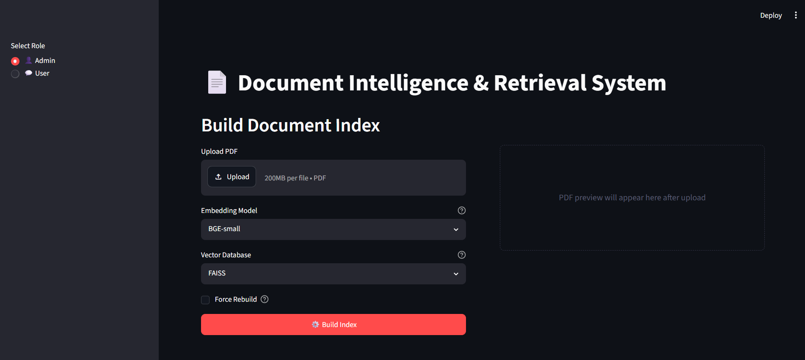
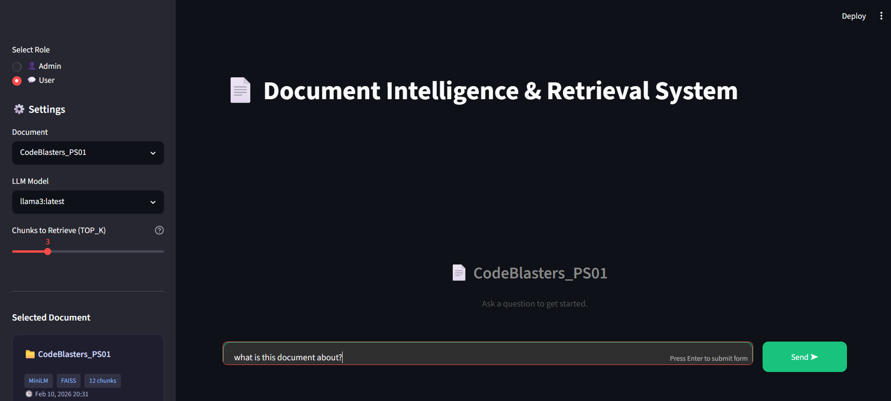
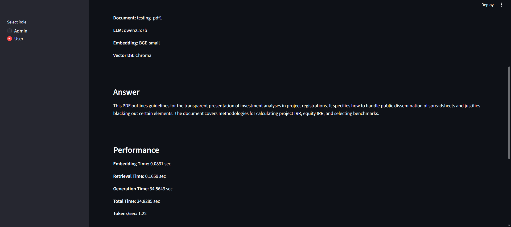
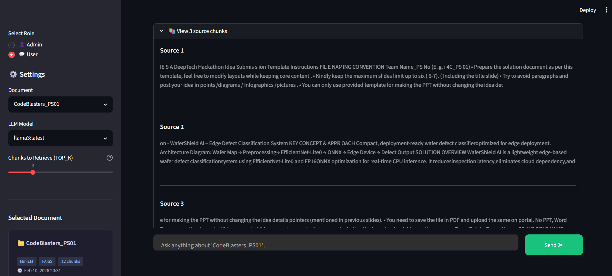

# DIRS — Document Intelligence & Retrieval System 

DIRS is a modular Retrieval-Augmented Generation (RAG) system built in Python. Upload any PDF document and ask natural language questions about its content — entirely on-premises, with no cloud APIs or external data transfer.

---

## What This Project Does

DIRS turns unstructured PDF documents into a searchable knowledge base. When a document is uploaded, the system extracts and chunks the text, generates vector embeddings, and stores them in a vector database. When a question is asked, it retrieves the most relevant chunks using a **hybrid retrieval strategy** — combining semantic vector search with BM25 keyword ranking — and passes them to a local LLM to generate a grounded answer.

This reduces hallucinations and keeps responses tightly tied to the document content.

---

## Key Capabilities

- PDF ingestion and structured text extraction
- Intelligent text chunking with configurable size and overlap
- Hybrid retrieval combining semantic search (FAISS / Chroma) and keyword ranking (BM25) with weighted score fusion
- In-memory caching of indices and retrievers for reduced query latency
- Choice of embedding models: BGE-small, MiniLM, E5-small
- Choice of local LLMs via Ollama: LLaMA 3, Qwen 2.5, Gemma
- Performance tracking and experiment logging to CSV
- Role-based UI: Admin (index builder) and User (question answering)
- Source transparency — retrieved chunks shown alongside answers

---

## How It Works

```
PDF Upload → Text Extraction → Chunking → Embedding → Vector Store
                                                            ↓
User Question → Query Embedding → Hybrid Retrieval (Vector + BM25)
                                                            ↓
                                        Context → LLM → Answer
```

---

## Tech Stack

| Component        | Technology                              |
|------------------|-----------------------------------------|
| Language         | Python 3.10+                            |
| Web Interface    | Streamlit                               |
| LLM Serving      | Ollama                                  |
| Language Models  | LLaMA 3, Qwen 2.5, Gemma               |
| Embeddings       | Sentence Transformers (BGE, MiniLM, E5) |
| Vector Search    | FAISS, ChromaDB                         |
| Keyword Search   | BM25 (rank-bm25)                        |
| PDF Parsing      | PyPDF                                   |

---

## User Roles

**Admin** — Uploads PDFs, selects embedding model and vector database, builds and manages the index.

**User** — Selects an indexed document, selects an LLM, asks questions, and receives grounded answers with source citations and performance metrics.

---

## Screenshots

### Admin Interface


### User Interface


### Answer with Performance Metrics


### Retrieved Sources


---

## Getting Started

For full installation instructions, environment setup, and usage guide, see **[SETUP.md](SETUP.md)**.

---

## Author

**Aman Srivastava**
amansri345@gmail.com